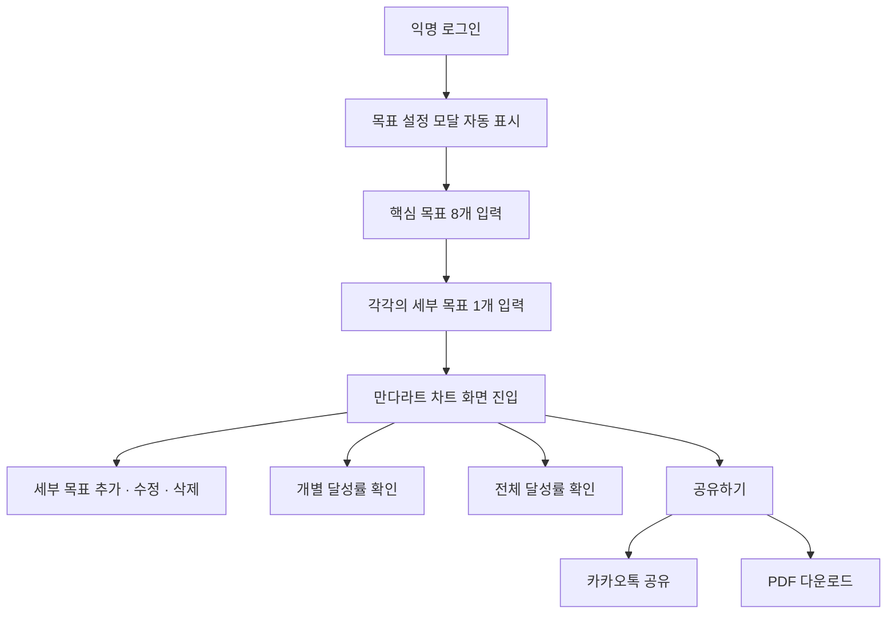

# 🧩 만다라트 플래너
> 핵심 목표와 8가지 세부 목표를 단계별로 시각화하고, 달성 과정을 한눈에 관리할 수 있는 목표 관리 솔루션

## 📌 목차
- [📖 프로젝트 소개](#intro)
- [✨ 주요 기능](#features)
- [🛠 기술 스택](#stack)
- [🏗 아키텍처 및 데이터 모델](#architecture)
- [🔄 사용자 흐름](#flow)
- [🎨 UI](#ui)
- [🤝 협업 및 역할 분담](#role)
- [🧠 문제 해결 및 고민한 점](#troubleshooting)
- [🚀 추후 개선 사항](#future)


## <h3 id="intro"> 📖 프로젝트 소개</h3>
만다라트 차트를 기반으로 목표를 설정하고 달성 과정을 시각적으로 관리할 수 있습니다.
익명 로그인으로 별도 회원가입 없이 바로 목표를 작성할 수 있으며, 
큰 목표와 세부 목표를 단계적으로 정리하여 진행 상황을 한눈에 확인할 수 있습니다.  

만다라트 차트를 통해 목표 간 관계를 시각화하고, 현실적으로 실행 가능한 단계로 나눌 수 있습니다.  
작성한 목표는 한 해를 돌아보거나, 다른 사람과 공유하며 서로 동기부여를 주고받을 수 있습니다.

가벼운 마음으로 목표를 작성하고, 
하나씩 달성해가는 과정을 기록해보세요.

## <h3 id="features"> ✨ 주요 기능</h3>

- **익명 로그인**
  - 회원가입 없이 바로 시작하고, 목표 데이터는 사용자별로 저장

- **만다라트 차트 기반 목표 설정**
  - 모달을 통해 최대 8개의 큰 목표와 각 목표별 세부 목표 설정
  - 단계적인 입력 흐름으로 목표를 자연스럽게 완성

- **목표 관리**
  - 세부 목표 수정 및 삭제
  - 변경 내용은 즉시 결과 화면에 반영

- **달성률 시각화**
  - 전체 및 목표별 달성률 표시

- **결과 공유**
  - 목표와 달성 현황을 PDF로 저장
  - 카카오톡을 통한 결과 공유 지원

## <h3 id="stack">🛠 기술 스택</h3>

### Frontend
<p>
  
  
  
</p>

### Backend 
<p>
  
</p>

### Tools
<p>
  
</p>

## <h3 id="architecture">🏗 아키텍처 및 데이터 모델</h3>

### 아키텍처

본 프로젝트는 화면과 상태, 데이터 저장의 역할을 명확히 분리한 구조로 설계했습니다.  
사용자 인터랙션은 모두 프론트엔드에서 처리하고, 목표 데이터만 저장하는 단순한 흐름을 유지합니다.

```text
UI (화면 / 모달)
      ↓
전역 상태
      ↓
데이터 저장
```

### 데이터 모델 

```text
목표 입력
  ↓
상태 업데이트
  ↓
달성률 계산
  ↓
화면 반영
  ↓
데이터 저장
```

## <h3 id="flow">🔄 사용자 흐름</h3>



## <h3 id="ui">🎨 UI </h3>

<table width="100%">
  <tr>
    <td align="center" width="50%">
      
    </td>
    <td align="center" width="50%">
      
    </td>
  </tr>
  <tr>
    <td align="center" width="50%">
      
    </td>
    <td align="center" width="50%">
      
    </td>
  </tr>
</table>


## <h3 id="role">🤝 협업 및 역할 분담</h3>

| 담당자 | 주요 역할 |
|------|----------|
| 유나 🌸| 결과 화면 · 목표 수정/삭제 · 달성률 표시 · 카카오톡 공유 |
| 보아 🌿| 익명 로그인 · 목표/세부 목표 생성 · 설정 모달 · PDF 다운로드  |


## <h3 id="troubleshooting">🧠 문제 해결 및 고민한 점</h3>

🐣 상세 내용을 업데이트할 예정입니다.


## <h3 id="future">🚀 추후 개선 사항</h3>

🐣 상세 내용을 업데이트할 예정입니다.
