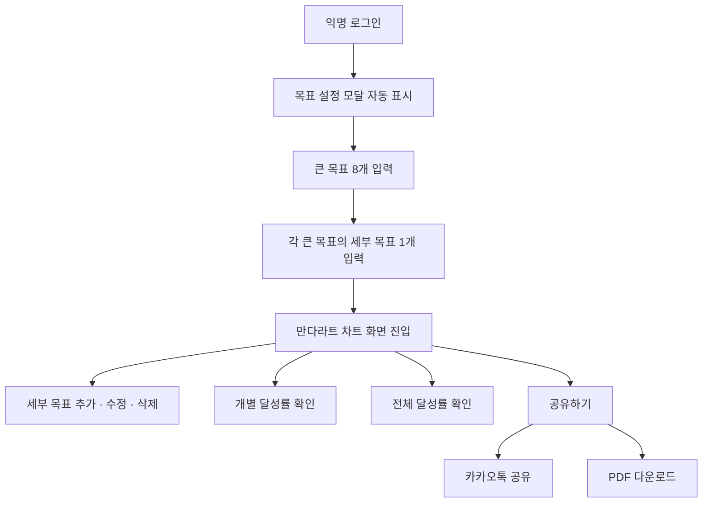

# 🧩 만다라트 차트
> 핵심 목표와 8가지 세부 계획을 한 화면에 시각화하는 목표 관리 솔루션

## 📌 목차
- [📖 프로젝트 소개](#intro)
- [✨ 주요 기능](#features)
- [🛠 기술 스택](#stack)
- [🏗 아키텍처 및 데이터 모델](#architecture)
- [🔄 사용자 흐름](#flow)
- [🎨 UI 및 인터랙션](#ui)
- [🤝 협업 및 역할 분담](#role)
- [🧠 문제 해결 및 고민한 점](#troubleshooting)
- [🚀 추후 개선 사항](#future)


## <h3 id="intro"> 📖 프로젝트 소개</h3>

만다라트 차트를 기반으로 목표를 설정하고 달성 과정을 시각적으로 관리할 수 있는 서비스입니다.  
익명 로그인을 통해 별도의 회원가입 없이 바로 목표를 설정할 수 있으며, 큰 목표와 세부 목표를 단계적으로 정리하면서 목표의 구조와 진행 상황을 한눈에 확인할 수 있도록 구성했습니다.

이 프로젝트는 목표를 한 번에 크게만 세우고, 정작 단계적으로 실행하지 못해 끝까지 도달하지 못했던 개인적인 경험에서 출발했습니다.  
만다라트 차트는 큰 목표를 중심으로 단계별 목표와 현실적으로 실행 가능한 세부 목표를 함께 정리할 수 있어, 목표를 막연하게 두는 것이 아니라 실제 행동으로 이어지게 도와줍니다.

단순히 목표를 나열하는 방식이 아니라, 목표 간의 관계를 만다라트 차트 형태로 시각화해 사용자가 자신의 방향성을 더 명확하게 인식할 수 있도록 하는 데 초점을 맞췄습니다.  
한 해가 지나 “올해 나는 무엇을 이뤘을까?”라는 질문이 들 때, 따로 정리할 필요 없이 작성해둔 만다라트 차트를 통해 스스로를 돌아볼 수 있고, 이를 다른 사람과 공유하며 동기부여를 얻는 경험도 할 수 있도록 구성했습니다.

가벼운 마음으로 목표를 적어보세요.  
그리고 그 하나하나를 직접 이뤄가는 과정을 기록해보세요.


## <h3 id="intro"> ✨ 주요 기능</h3>

- **익명 로그인**
  - 회원가입 없이 바로 시작하고, 목표 데이터는 사용자별로 저장

- **만다라트 차트 기반 목표 설정**
  - 모달을 통해 최대 8개의 큰 목표와 각 목표별 세부 목표 설정
  - 단계적인 입력 흐름으로 목표를 자연스럽게 완성

- **목표 관리**
  - 세부 목표 수정 및 삭제
  - 변경 내용은 즉시 결과 화면에 반영

- **달성률 시각화**
  - 전체 및 목표별 달성률 표시
  - 목표 hover 시 파도처럼 차오르는 애니메이션으로 진행률을 표현

- **결과 공유**
  - 목표와 달성 현황을 PDF로 저장
  - 카카오톡을 통한 결과 공유 지원


## <h3 id="stack">🛠 기술 스택</h3>

### Frontend
<p>
  
  
  
</p>

### Backend & Infra
<p>
  
</p>

### Tools
<p>
  
</p>


## <h3 id="architecture">🏗 아키텍처 및 데이터 모델</h3>

### 아키텍처

본 프로젝트는 화면과 상태, 데이터 저장의 역할을 명확히 분리한 구조로 설계했습니다.  
사용자 인터랙션은 모두 프론트엔드에서 처리하고, 목표 데이터만 저장하는 단순한 흐름을 유지합니다.

```text
UI (화면 / 모달)
      ↓
전역 상태
      ↓
데이터 저장
```

### 데이터 모델 

```text
목표 입력
  ↓
상태 업데이트
  ↓
달성률 계산
  ↓
화면 반영
  ↓
데이터 저장
```

## <h3 id="flow">🔄 사용자 흐름</h3>



## <h3 id="ui">🎨 UI 및 인터랙션</h3>


## <h3 id="role">🤝 협업 및 역할 분담</h3>

| 담당자 | 주요 역할 |
|------|----------|
| 유나 🌸| 결과 화면 · 목표 수정/삭제 · 달성률 표시 · 카카오톡 공유 |
| 보아 🌿| 익명 로그인 · 목표/세부 목표 생성 · 설정 모달 · PDF 다운로드  |


## <h3 id="troubleshooting">🧠 문제 해결 및 고민한 점</h3>

🐣 상세 내용을 업데이트할 예정입니다.


## <h3 id="future">🚀 추후 개선 사항</h3>

🐣 상세 내용을 업데이트할 예정입니다.
